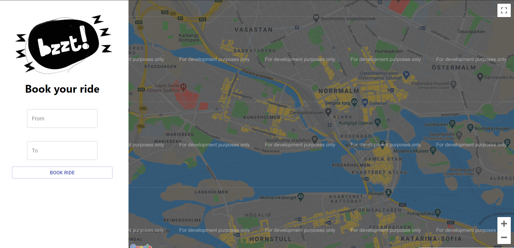
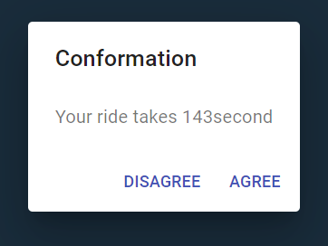
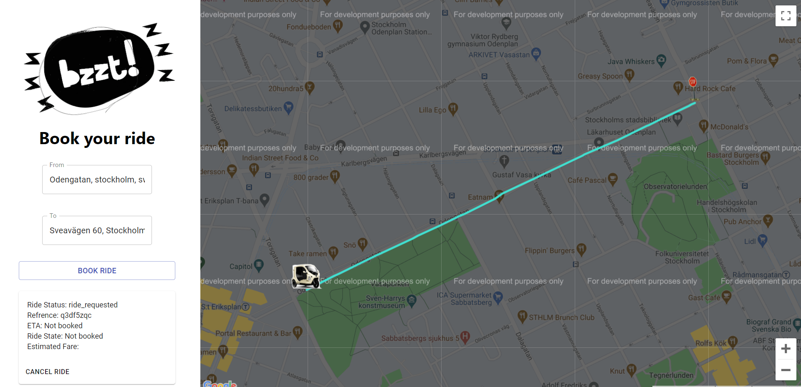

# bzzt-test

## Programming Languages used ReactJs

ReactJs is an open-source, front end, JavaScript library for building user interfaces or UI components.

## Installation

1)Use the package manager [NodeJs](https://nodejs.org/en/download/) to install NodeJs on your machine.

2)Verify Installation by opening a command prompt (or PowerShell), and enter the following: 'npm –v'  

3) Pull the git repository [GIT](https://github.com/bzzt/Taxi-business-customer)

4) For installing front-end open your Command Prompt and then go to the repository on your machine (Example: cd ..your location..\bzzt-test)

5) Then type 'npm install' and enter to download all dependecies for front-end.

6) yippee you have completed installation and ready to run application.

## Usage

1) add your google api key in (..\bzzt-test\src\App.js line:144)

2)For starting front-end open your Command Prompt and then go to the repository on your machine (Example: cd ..your location..\bzzt-test)

3) Then type 'npm start' and enter to start front-end.

4) The front-end will automatically open the web page.

5) Enjoy the page.

## Features

1) Book ride by giving the to and from locations.

2) Time estimate conformation dialog.

3) Booking status is displayed only after booking accepted.

4) Cancel ride.

5) Refresh button to refresh booking status.

6) All error messages are displayed by alert box.

## Features added later on

1) Location feature.

2) Animated image for page background.

## Contributing

Pull requests are welcome. For changes, we can discuss what you would like to change and work together.
